<!--
# ARROWS: 
↑ ↓ ← → ↔ ↕
← → ↔ ↑ ↓ • ↕ • ↖ ↗ ↘ ↙ • ⤡ ⤢
⬅ ( ⮕ ➡ ) ⬆ ⬇ • ⬌ ⬍ • ⬉ ⬈ ⬊ ⬋
⇦ ⇨ ⇧ ⇩ • ⬁ ⬀ ⬂ ⬃ • ⬄ ⇳
➛ ➜ ➔ ➝ ➞ ➟ ➠ ➧ ➨
⭠ ⭢ ⭤ ⭡ ⭣ ⭥ 
-->

<!-- ---------------------------------------------------- -->
# Phase-type distributions
<!-- ---------------------------------------------------- -->

## The coalescent as a **Markov jump process**

:::{.spacer-2}
:::

::: {.r-stack }

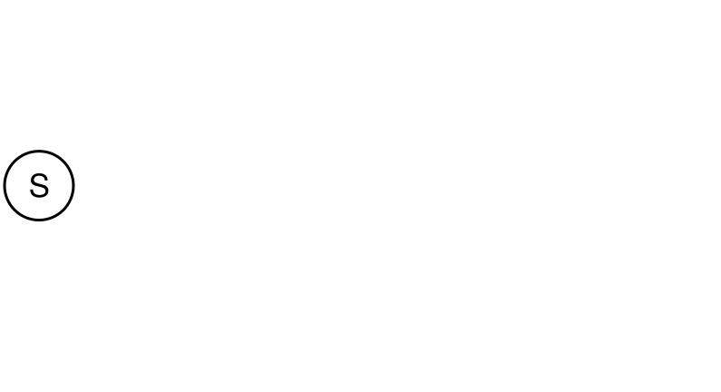{.nostretch width="100%" fig-align="left"}

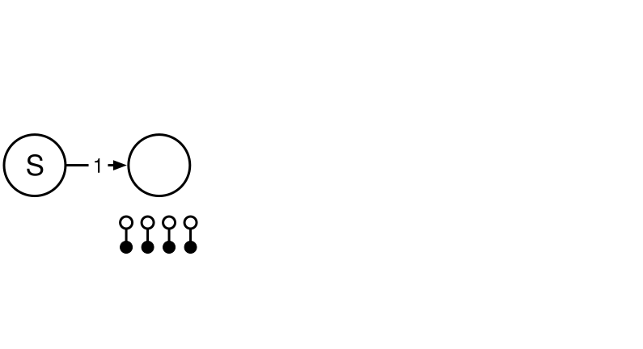{.nostretch width="100%"  fig-align="left" .fragment}

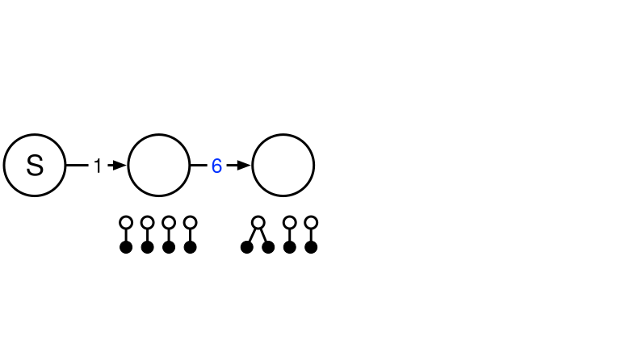{.nostretch width="100%"  fig-align="left" .fragment}

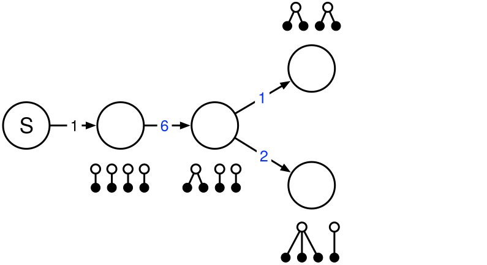{.nostretch width="100%"  fig-align="left" .fragment}

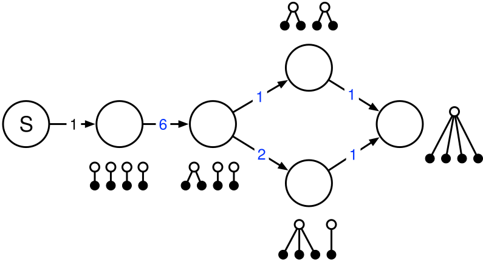{.nostretch width="100%"  fig-align="left" .fragment}
::::

## The coalescent as a **Markov jump process**

::: {layout="[0.55,-0.05,0.4]"}

:::: {.column}

:::{.spacer-2}
:::

{.nostretch height="30%" fig-align="left"}

::::
:::: {.column}

::::: {.fragment}
$\tau \sim \mathrm{PH}(\boldsymbol{\alpha}, {\color{blue} \boldsymbol{S}})$
:::::
::::: {.fragment}
$\boldsymbol{\alpha} = (1, 0, 0, 0)$
:::::
::::: {.fragment}
${\color{blue}\boldsymbol{S}} = 
\begin{bmatrix}
-6 &  6  &  & \\
   & -3  & 1  & 2 \\
   &     & -1  & \\
   &     &  & -1 \\
\end{bmatrix}$
:::::
::::: {.fragment}
$\mathbb{E}[\tau] = \boldsymbol{\alpha} \boldsymbol{U} \boldsymbol{e}$

$\boldsymbol{U} = -{\color{blue}\boldsymbol{S}}^{-1}$
:::::

::::
:::

<!-- ---------------------------------------------------- -->
# Reward transforms
<!-- ---------------------------------------------------- -->

## The coalescent as a **Markov jump process**

::: {layout="[0.55,-0.05,0.4]"}

:::: {.column}

:::{.spacer-2}
:::

{.nostretch height="30%" fig-align="left"}

::::
:::: {.column}

::::: {.fragment}
$\tau \sim \mathrm{PH}(\boldsymbol{\alpha}, {\color{blue} \boldsymbol{S}}, {\color{red} \boldsymbol{r}})$
:::::
::::: {.fragment}
$\boldsymbol{\alpha} = (1, 0, 0, 0)$
:::::
::::: {.fragment}
${\color{blue}\boldsymbol{S}} = 
\begin{bmatrix}
-6 &  6  &  & \\
   & -3  & 1  & 2 \\
   &     & -1  & \\
   &     &  & -1 \\
\end{bmatrix}$
:::::
::::: {.fragment}

${\color{red} \boldsymbol{r}} = (4,\ 3,\ 2,\ 2)$

:::::
::::: {.fragment}
$\mathbb{E}[\tau] = \boldsymbol{\alpha} \boldsymbol{U}\!\, \triangle \! \,({\color{red}\boldsymbol{r}})\, \boldsymbol{e}$

$\boldsymbol{U} = -{\color{blue}\boldsymbol{S}}^{-1}$
:::::
::::
:::

## **Phase-type** distributed waiting time

::: {layout="[[-0.1,0.45,-0.05,0.4], [-0.1,0.45,-0.05,0.4]]"}

:::: {.column}

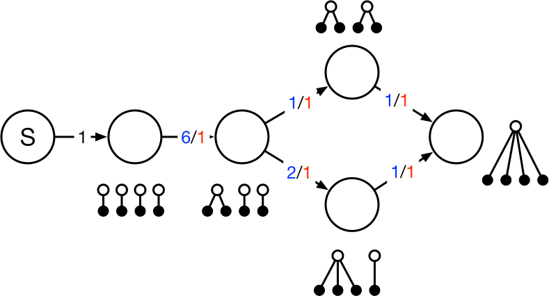

:::: 

:::: {.column .fragment}

**TMRCA (tree height):**

${\color{red} \boldsymbol{r}} = (1,\ 1,\ 1,\ 1)$

$\mathbb{E}[\tau] = \boldsymbol{\alpha} \boldsymbol{U}\!\, \triangle \! \,({\color{red}\boldsymbol{r}})\, \boldsymbol{e}$

:::: 

:::: {.column .fragment}

::::

:::: {.column .fragment}

**Total branch length:**

${\color{red} \boldsymbol{r}} = (4,\ 3,\ 2,\ 2)$

$\mathbb{E}[\tau] = \boldsymbol{\alpha} \boldsymbol{U}\!\, \triangle \! \,({\color{red}\boldsymbol{r}})\, \boldsymbol{e}$

:::: 

:::

## Singleton branch length using **reward transformation**

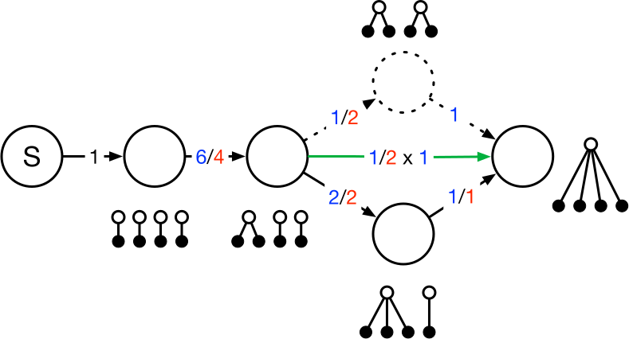

Null rewarded node is removed and edge is created or updated:

$w(u \rightarrow z) = w(u \rightarrow v) \frac{w(v \rightarrow z)}{\sum_{x \in x } w(v \rightarrow x)}$

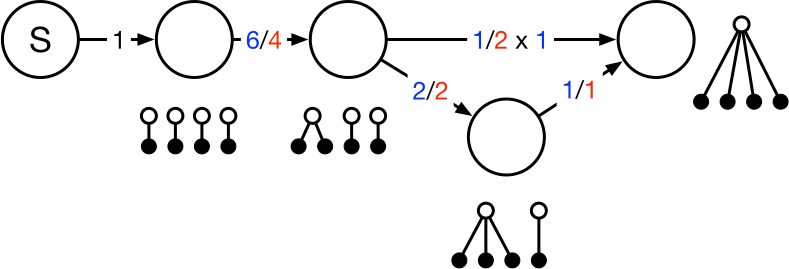

## Doubleton branch length using **reward transformation**

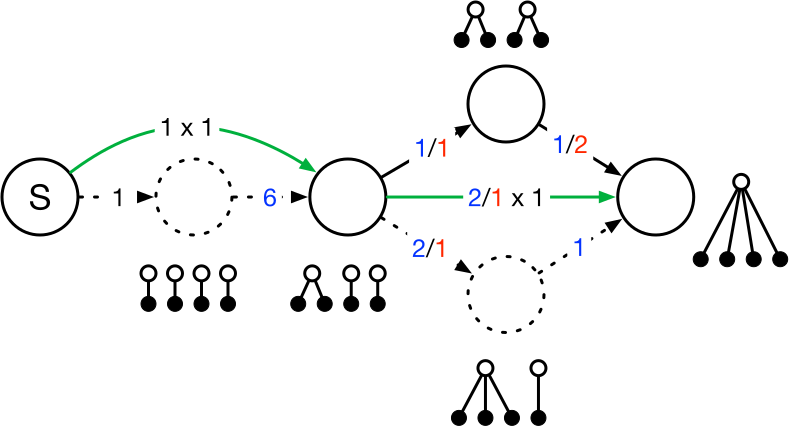

<!-- ---------------------------------------------------- -->
# Graph Algorithms
<!-- ---------------------------------------------------- -->

## **Matrix formulation** of phase-type distributions

::: {layout="[[0.45,-0.05,0.45], [0.45,-0.05,0.45]]"}
:::: {.column}

😀 Proofs and well-described properties:

CDF: $\; \; \; F_\tau(t) = 1 - \boldsymbol{\alpha}e^{\boldsymbol{S}t}\boldsymbol{e}, \;\; t\geq 0$

MGF: $\; \; \; \mathbb{E}[\tau^k]=k!\boldsymbol{\alpha} (\boldsymbol{U}\triangle({\color{black}\boldsymbol{r}}))^{k}\boldsymbol{e}$

::: {.spacer-1}
:::

😱 Complexity:

Matrix operations (${\boldsymbol{S}}^{-1}$ and ${\boldsymbol{S}}^{t}$)
limit applicability. Needlessly so for sparse matrices.

::::
:::: {.column}

Coalescent n=10:

::: {.r-stack}
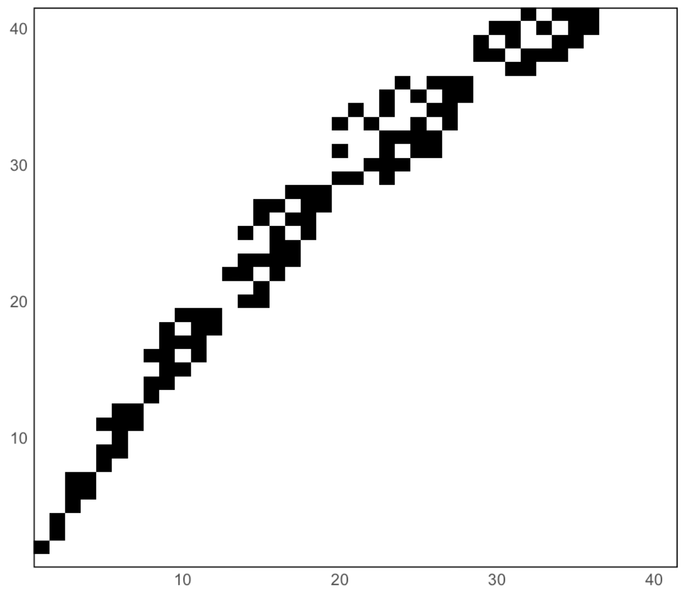{.nostretch height="30%" fig-align="center" .disappear}

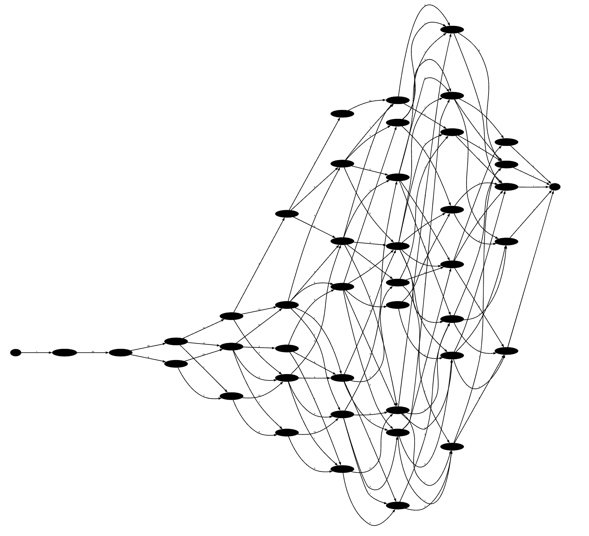{.nostretch height="30%" fig-align="center" .fragment }
:::

::::
:::

## A **graph-formulation** of phase-type distributions

::: {layout="[0.40,-0.05,0.1,-0.05,0.40]"}
:::: {.column}

::: {.spacer-3}
:::
{.nostretch height="20%" fig-align="center"}

::::
:::: {.column}

::: {.r-fit-text .center}
⮕
:::

::::
:::: {.column}

{.nostretch height="30%" fig-align="center"}

::::
:::

## A **graph-formulation** of phase-type distributions

- DAG construction from graph with cycles.
- Exact moments by graph recursion.
- Exact marginal moments by reward transformation.
- Discrete PtD from continuous PtD.
- CDF for discrete and continuous PtDs
- C implementation exposed in R
- Intuitive state-space construction.

## Computing **moments** from the graph

::: {layout="[0.40,-0.05,0.1,-0.05,0.40]"}
:::: {.column}

- Acyclic graphs:
  - Standardization of the graph.
  - Recursion in reverse topological order.
- Graphs with cycles:
  - Standardization of the graph.
  - Construction of a corresponding acyclic graph
  - Recursion in reverse topological order.

::::
:::: {.column}

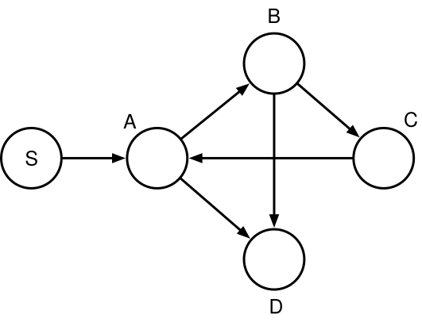

::::
:::

## Computing **moments** from the graph

## **Standardization** of the graph

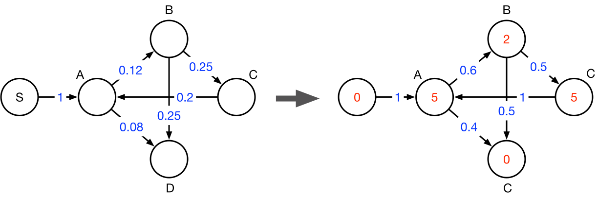

## Constructing an **acyclic graph** retaining the expected accumulated rewards

## Constructing an **acyclic graph**

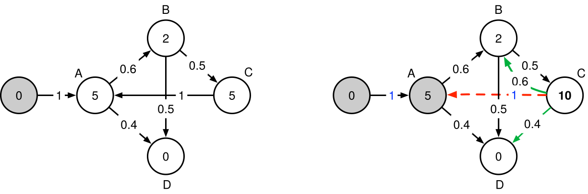{.nostretch width="80%" fig-align="center"}

::: {layout="[-0.05,0.4,-0.05,0.4]"}
:::: {.column}

**Edges:** 

$w(\mathrm{C}\rightarrow \mathrm{D}) = w(\mathrm{C}\rightarrow \mathrm{A})\, w(\mathrm{A}\rightarrow \mathrm{D})$

**Vertices:** 

$x_A \leftarrow x_C + x_A$
::::
:::: {.column}

Insert the first equation in the third: 

$\begin{align*}
T_C &= 5 + (5 + 0.6 \cdot T_B + 0.4 \cdot T_D) \\ 
&= 10 + 0.6 \cdot T_B + 0.4 \cdot T_D
\end{align*}$

::::
:::

## Constructing an **acyclic graph**

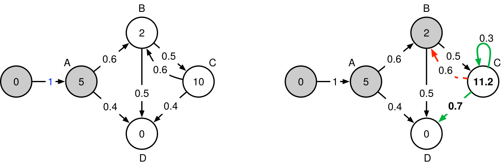{.nostretch width="80%" fig-align="center"}

::: {layout="[-0.1,0.4,-0.05,0.4]"}
:::: {.column}
$x_\mathrm{C} +\!\,= x_\mathrm{A}\, w(\mathrm{C}\rightarrow \mathrm{A})$

$x_C \leftarrow 0.6 \cdot x_C$

::::
:::: {.column}

Insert the second equation in the third: 
  
$\begin{align*}
T_C &= 5 + T_A + 0.6 \cdot ( T_B + 0.5 \cdot T_C + 0.5 \cdot T_D) \\ 
&= 11.2 + 0.3 \cdot T_C + 0.7 \cdot T_D
\end{align*}$

::::
:::

## Constructing an **acyclic graph**

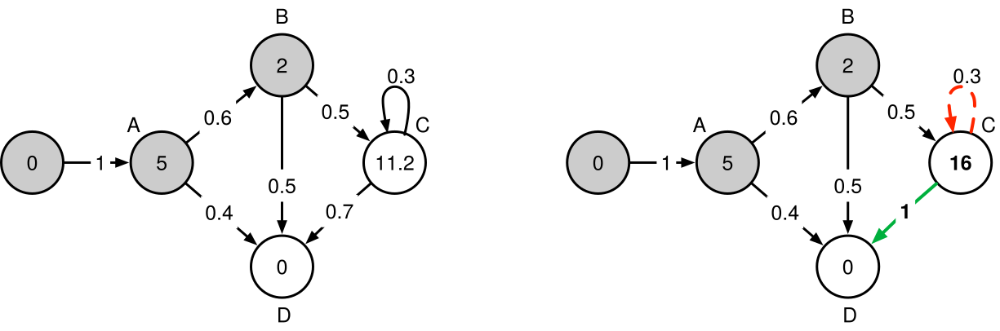{.nostretch width="80%" fig-align="center"}

::: {layout="[-0.1,0.4,-0.05,0.4]"}
:::: {.column}

$x_C \leftarrow x_C + x_C \cdot \big(\frac{1}{1-0.6}-1\big)$

::::
:::: {.column}

Isolate $T_C$ in the third equation to remove self-loop: 
  
$\begin{align*}
T_C &= 11.2 + 0.3 \cdot T_C + 0.7 \cdot T_C \\
&= 16 + T_D
\end{align*}$

::::
:::

## Constructing an **acyclic graph**

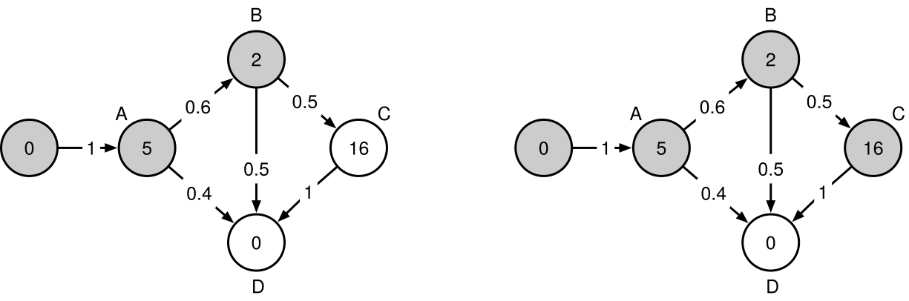{.nostretch width="80%" fig-align="center"}

::: {layout="[-0.1,0.4,-0.05,0.4]"}
:::: {.column}

::::
:::: {.column}

::::
:::

## Constructing an **acyclic graph**

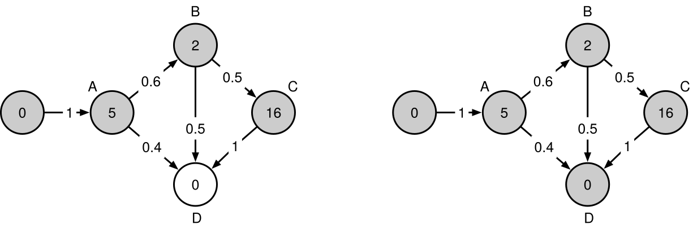{.nostretch width="80%" fig-align="center"}

::: {layout="[-0.1,0.4,-0.05,0.4]"}
:::: {.column}

::::
:::: {.column}

::::
:::

## Constructing an **acyclic graph** retaining the expected accumulated rewards

::: {layout="[0.24,-0.05,0.4,-0.05,0.25]"}

:::: {.column}

$\begin{align*}
T_A &= 5 + 0.6 \cdot T_B + 0.4 \cdot T_D \\
T_B &= 2 + 0.5 \cdot T_C + 0.5 \cdot T_D \\
T_C &= 5 + T_A \\
T_D &= 0
\end{align*}$

Insert the first equation in the third:  
$\begin{align*}
T_C &= 5 + (5 + 0.6 \cdot T_B + 0.4 \cdot T_D) \\ 
&= 10 + 0.6 \cdot T_B + 0.4 \cdot T_D
\end{align*}$

Insert the second equation in the third:  
$\begin{align*}
T_C &= 5 + T_A + 0.6 \cdot ( T_B + 0.5 \cdot T_C + 0.5 \cdot T_D) \\ 
&= 11.2 + 0.3 \cdot T_C + 0.7 \cdot T_D
\end{align*}$

Isolate $T_C$ in the third equation to remove self-loop:  
$\begin{align*}
T_C &= 11.2 + 0.3 \cdot T_C + 0.7 \cdot T_C \\
&= 16 + T_D
\end{align*}$

The equations are now:  
$\begin{align*}
T_A &= 5 + 0.6 \cdot T_B + 0.4 \cdot T_D \\
T_B &= 2 + 0.5 \cdot T_C + T_D\\
T_C &= 16 + T_D \\
T_D &= 16
\end{align*}$

::::
:::: {.column}

::::
:::: {.column}

$$
w(\mathrm{C}\rightarrow \mathrm{D}) = w(\mathrm{C}\rightarrow \mathrm{A})\, w(\mathrm{A}\rightarrow \mathrm{D})
$$
$$
x_\mathrm{C} +\!\,= x_\mathrm{A}\, w(\mathrm{C}\rightarrow \mathrm{A})
$$

$$
w(\mathrm{C}\rightarrow \mathrm{D}) = \frac{w(\mathrm{C}\rightarrow \mathrm{D})}{1 - w(\mathrm{C}\rightarrow \mathrm{C})}
$$
$$
x_\mathrm{C} +\!\,= x_\mathrm{C} \left ( \frac{1}{1-w(\mathrm{C}\rightarrow \mathrm{C})} - 1\right)
$$

::::

:::

## Constructing an **acyclic graph** retaining the expected accumulated rewards

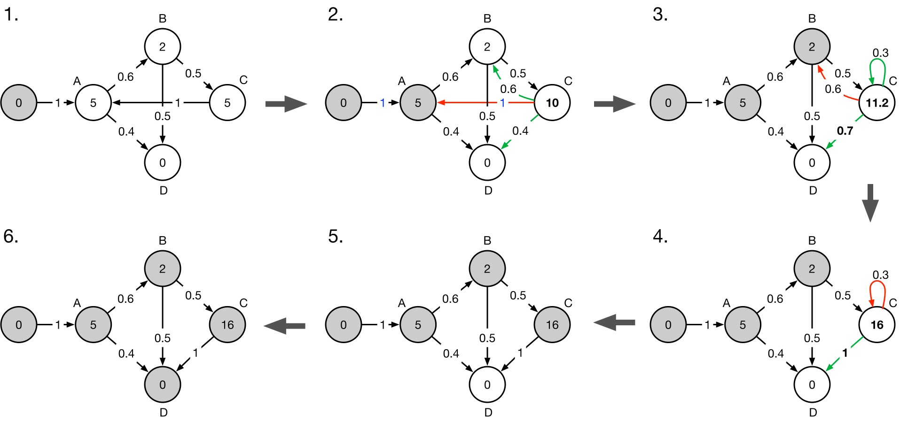

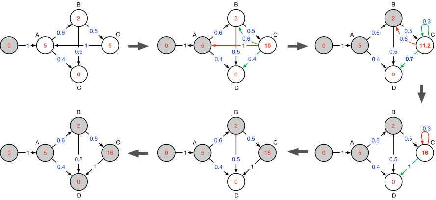

## Gauss elimination - reinvented

## Compute **expectation** by recursion in reverse topological order

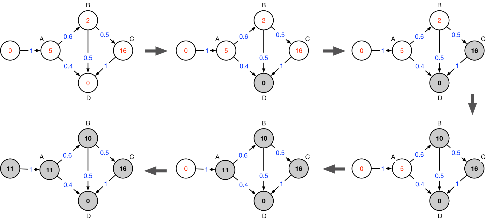

## Compute **expectation** by recursion in reverse topological order

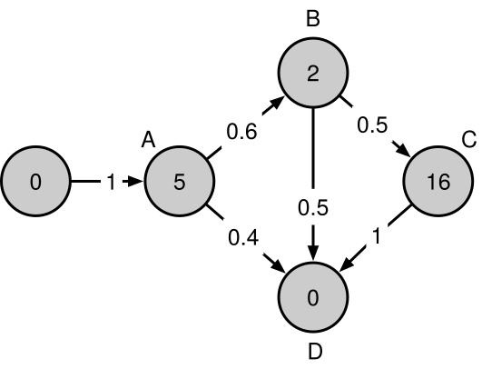

Computed by `expected_waiting_time(graph, [rewards])`

(11, 10, 16) are the row sums of the Green matrix. 
I.e. the expected waiting times starting at each vertex.

## Higher-order **moments**

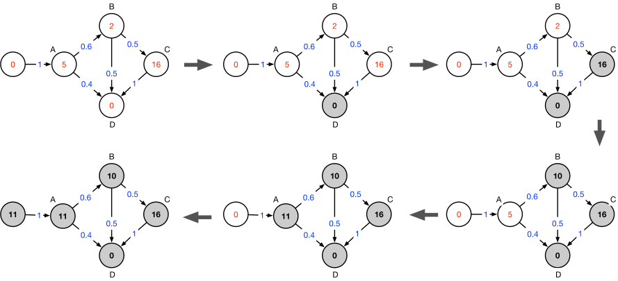

## Higher-order **moments**

k’th moment: $\mathbb{E}[\tau^k]=k!\boldsymbol{\alpha} (\boldsymbol{U}\triangle(\boldsymbol{r}))^{k}\boldsymbol{e}$

Expectation: $\mathbb{E}[\tau] = \boldsymbol{\alpha} \boldsymbol{U}\triangle(\boldsymbol{r})\boldsymbol{e}$

2'nd moment: $\mathbb{E}[\tau^2] = 2\cdot\boldsymbol{\alpha} \boldsymbol{U}\triangle(\boldsymbol{r})\boldsymbol{U}\triangle(\boldsymbol{r})\boldsymbol{e}$

$\mathbb{E}[\tau] = \boldsymbol{\alpha} \boldsymbol{U}\! \triangle\!\,(\boldsymbol{r}) \boldsymbol{e} = \boldsymbol{\alpha} \boldsymbol{U}  \boldsymbol{e}$ (assuming unit rewards for simplicity).

$\mathbb{E}[\tau^2] = 2\cdot\boldsymbol{\alpha} \boldsymbol{U}\boldsymbol{U}\boldsymbol{e}$

$\boldsymbol{U}\boldsymbol{e} = \boldsymbol{r'} = \triangle\!\,(\boldsymbol{r'}) \boldsymbol{e}$. So the variance can be written as: $\mathbb{E}[\tau^2] = 2\cdot\boldsymbol{\alpha} \boldsymbol{U}\!\triangle\!\,(\boldsymbol{r'}) \boldsymbol{e}$, where $\boldsymbol{r'}$ are the waiting times computed for the first moment.

## Higher-order **moments**

- Higher-order moments are the expectation with different rewards.
- Keep a parameterized list of graph manipulations to avoid redoing the O(V3) expensive conversion to acyclic.
- Rewards are applied as scalars and do not require recomputation.
- Additional moments can then be computed in O(V2) time.

## Higher-order **moments**

**1’ moment: 3**

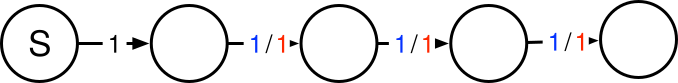{.nostretch width="50%" fig-align="left"}

`expected_waiting_time(graph)` → $(\boldsymbol{3},\ 3,\ 2,\ 1,\ 0)$

**2’ moment: 12**

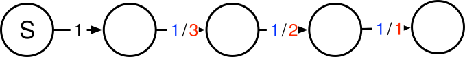{.nostretch width="50%" fig-align="left"}

`expected_waiting_time(graph, expected_waiting_time(graph))` → $(\boldsymbol{6},\ 6,\ 3,\ 1,\ 0)$

## **Discrete** phase-type distributions

{.nostretch height="30%" fig-align="center"}

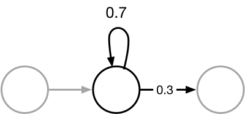{.nostretch height="30%" fig-align="center"}

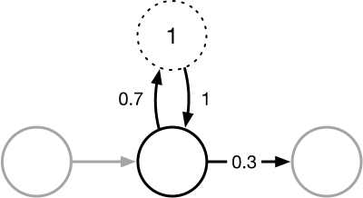{.nostretch height="30%" fig-align="center"}

<!-- 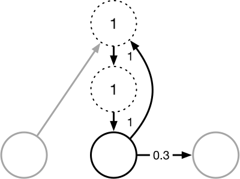 -->

<!-- ---------------------------------------------------- -->
# Laplace Transform
<!-- ---------------------------------------------------- -->

## **Laplace** Transform

<!-- ---------------------------------------------------- -->
# Joint probability of discrete events
<!-- ---------------------------------------------------- -->

## **Joint probability** of discrete events

## **Truncated** multivariate discrete phase-type distributions

<!-- ---------------------------------------------------- -->
# State Lumping
<!-- ---------------------------------------------------- -->

## The **block** coalescent

:::: {.columns}
::: {.column width="50%"}

::: {.spacer-1}
:::

Left column left column left column

Left column left column left column

::: {.spacer-1}
:::

- Left column left column left column
- Left column left column left column
:::
::: {.column width="50%"}
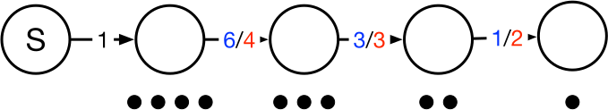

::: {.spacer-1}
:::

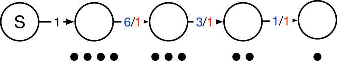

::: {.spacer-1}
:::

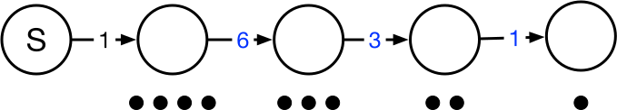
:::
::::

<!-- ---------------------------------------------------- -->
# Time-inhomogeneous models with phase-type distributions
<!-- ---------------------------------------------------- -->

## **Time-inhomogeneous** models

## **CDF** for Time-inhomogeneous models

## **van Loen** graph trick

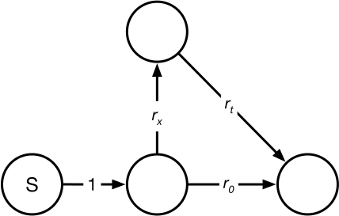

<!-- ---------------------------------------------------- -->
# Performance
<!-- ---------------------------------------------------- -->

## Coalescent 100 marginal moments

<!-- ---------------------------------------------------- -->
# Popgen models
<!-- ---------------------------------------------------- -->

## Statistical properties of the standard coalescent

## Isolation with migration model 

## The coalescent conditioned on a derived variant

## The coalescent with selection

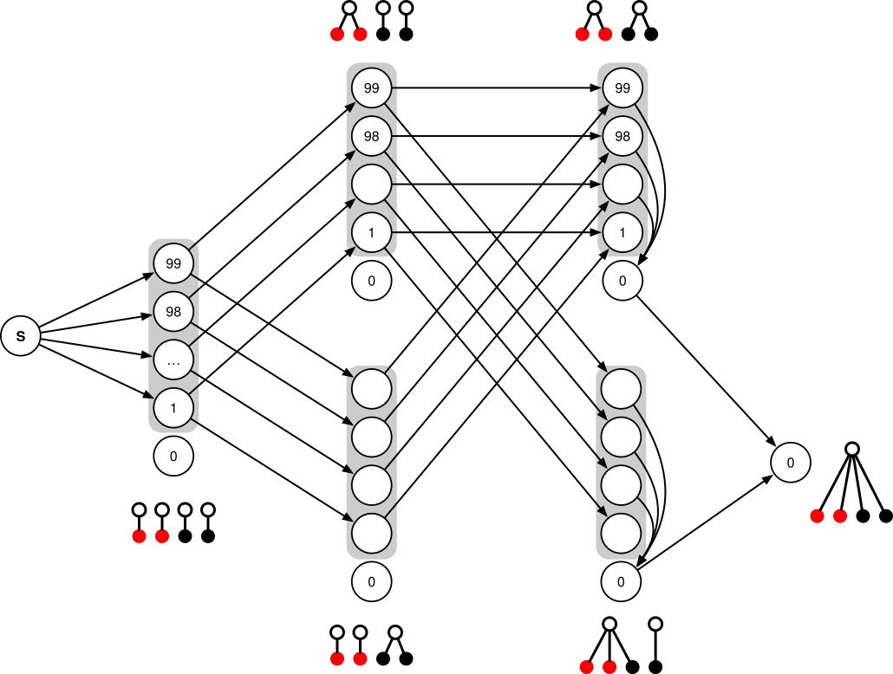

<!-- ---------------------------------------------------- -->
# Inference with SVGD
<!-- ---------------------------------------------------- -->

<!-- ---------------------------------------------------- -->
<!-- ---------------------------------------------------- -->
<!-- ---------------------------------------------------- -->

## Header

- blah blah blah...
- blah blah blah...

{.nostretch width="50%" fig-align="center"}

## Header

:::: {.columns}
::: {.column width="40%"}
- Left column left column left column
- Left column left column left column
- Left column left column left column
- Left column left column left column
:::
::: {.column width="60%"}

:::
::::

::: {.spacer-2}
:::

{.nostretch width="80%" fig-align="center"}

## Header

## Header

## Header

$$
\mathbb{E}_u[\tilde{\tau}] = x_u + w'(u \to v) \cdot \mathbb{E}_v[\tilde{\tau}] + \sum_{z \neq v} w'(u \to z) \cdot \mathbb{E}_z[\tilde{\tau}].
$$

## Admixture displacement in each  **geographical region** {.smaller}

::: {.spacer-md} 
:::

Here we have some text that may run over several lines of the slide frame,
depending on how long it is.

- first item 
    - A sub item

Next, we'll brief review some theme-specific components.

- Note that _all_ of the standard Reveal.js
[features](https://quarto.org/docs/presentations/revealjs/)
can be used with this theme, even if we don't highlight them here.

## Additional theme classes

### Some extra things you can do with the clean theme

Special classes for emphasis

- `.alert` class for default emphasis, e.g. [important note]{.alert}.
- `.fg` class for custom colour, e.g. [important note]{.fg style="--col: #e64173"}.
- `.bg` class for custom background, e.g. [important note]{.bg style="--col: #e64173"}.

Cross-references

- `.button` class provides a Beamer-like button, e.g.
[[Summary]{.button}](#sec-summary)

---------------------------------------------------------------

In Denmark, the workplace interaction is very informal and largely unaffected by seniority and age. 

$$
\frac{\partial f}{\partial \theta_j} = \frac{\partial \lambda}{\partial \theta_j} \cdot \text{PMF} + \lambda \sum_k \frac{\partial a_k}{\partial \theta_j} \operatorname{Po}(k; \lambda t) + \lambda \sum_k a_k 
$$

## Social norms

### Neither academic seniority or age affected interaction

<!-- a bug in quarto does not allow successive embeds witout somthing in between (like this) -->

## Slide title

::: {.incremental}
- Eat spaghetti
- Drink wine
:::

## Slide title

:::: {.columns}

::: {.column width="40%"}
Left column
:::

::: {.column width="60%"}
- One
- Two
- Three
:::

::::

## header

::: {.r-stretch}


:::

## Slide Title

Slide content

::: aside
Schumer et al. (2018)
:::

