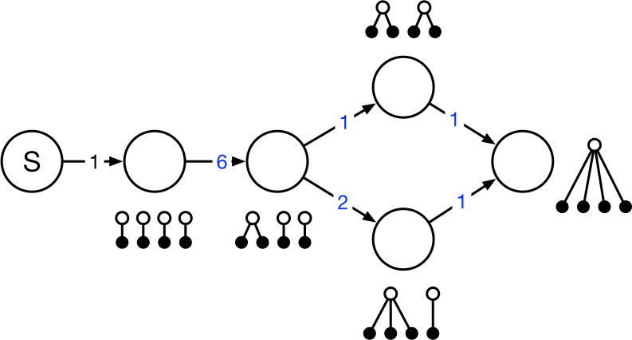

<!-- ---------------------------------------------------- -->
# Phase-type distributions
<!-- ---------------------------------------------------- -->

## The coalescent as a markov jump process


## The coalescent as a markov jump process

{.nostretch width="60%" fig-align="left"}

## The coalescent as a markov jump process

{.nostretch width="60%" fig-align="left"}

## The coalescent as a markov jump process

{.nostretch width="60%" fig-align="left"}

## The coalescent as a markov jump process

{.nostretch width="60%" fig-align="left"}


## Phase-type distributed waiting time


::: {layout="[[0.45,-0.05,0.45], [0.45,-0.05,0.45]]"}

:::: {.column}



:::: 

:::: {.column .fragment}

$\tau \sim \mathrm{PH}(\boldsymbol{\alpha}, {\color{blue} \boldsymbol{S}})$

$\mathbb{E}[\tau] = \boldsymbol{\alpha} \boldsymbol{U} \boldsymbol{e}$

$\boldsymbol{U} = -{\color{blue}\boldsymbol{S}}^{-1}$

:::: 

:::: {.column .fragment}


::::

:::: {.column .fragment}

$\tau \sim \mathrm{PH}(\boldsymbol{\alpha}, {\color{blue} \boldsymbol{S}}, {\color{red} \boldsymbol{r}})$

$\mathbb{E}[\tau] = \boldsymbol{\alpha} \boldsymbol{U}\!\, \triangle \! \,({\color{red}\boldsymbol{r}})\, \boldsymbol{e}$

${\color{red} \boldsymbol{r}} = (4,\ 3,\ 2,\ 2)$

:::: 

:::


## layout tester

::: {layout="[ 0.48, -0.04, 0.48 ]"}
:::: {#first-column}

- thing  laksdj flakjsd flaksj dflkasj flkasj dflkasj dflkasj dflkajs dflkajs dflkajs dflkasj dflkajs dflaksj dflakjs dflkajsd flaksjf
- thing 1b

::::
:::: {#second-column}

- thing  laksdj flakjsd flaksj dflkasj flkasj dflkasj dflkasj dflkajs dflkajs dflkajs dflkasj dflkajs dflaksj dflakjs dflkajsd flaksjf

::::
:::

## The coalescent as a markov jump process

:::: {.columns}
::: {.column width="50%"}

{fig-align="left"}

:::
::: {.column width="50%"}

$$
\boldsymbol{\alpha} = (\alpha_1, \ldots, \alpha_p)
$$

$$
{\color{blue}\boldsymbol{S}} = 
\begin{bmatrix}
-6 &  6  &  & \\
   & -3  & 1  & 2 \\
   &     & -1  & \\
   &     &  & -1 \\
\end{bmatrix}
$$

:::
::::

## The coalescent as a markov jump process


## The coalescent as a markov jump process

:::: {.columns}
::: {.column width="50%"}

::: {.spacer-1}
:::

Left column left column left column

Left column left column left column

::: {.spacer-1}
:::

- Left column left column left column
- Left column left column left column
:::
::: {.column width="50%"}


::: {.spacer-1}
:::


::: {.spacer-1}
:::


:::
::::


## The TMRCA is phase-type distributed


## Total branch length follow a rewarded is phase-type distribution


## Singleton branch length using reward transformation


Null rewarded node is removed and edge is created or updated:

$w(u \rightarrow z) = w(u \rightarrow v) \frac{w(v \rightarrow z)}{\sum_{x \in x } w(v \rightarrow x)}$


## Doubleton branch length using reward transformation


<!-- ---------------------------------------------------- -->
# Graph Algorithms
<!-- ---------------------------------------------------- -->

## Matrix formulation of phase-type distributions

::: {layout="[[0.45,-0.05,0.45], [0.45,-0.05,0.45]]"}
:::: {.column}

😀 Proofs and well-described properties:

CDF: $\; \; \; F_\tau(t) = 1 - \boldsymbol{\alpha}e^{\boldsymbol{S}t}\boldsymbol{e}, \;\; t\geq 0$


MGF: $\; \; \; \mathbb{E}[\tau^k]=k!\boldsymbol{\alpha} (\boldsymbol{U}\triangle({\color{black}\boldsymbol{r}}))^{k}\boldsymbol{e}$

::: {.spacer-1}
:::

😱 Complexity:

Matrix operations (${\boldsymbol{S}}^{-1}$ and ${\boldsymbol{S}}^{t}$)
limit applicability. Needlessly so for sparse matrices.

::::
:::: {.column}

Coalescent n=10:

{.nostretch height="30%" fig-align="center"}

::::
:::


## A graph-formulation of phase-type distributions

## Computing moments from the graph

## Standardization of the graph


## Constructing an acyclic graph retaining the expected accumulated rewards


## Gauss elimination - reinvented

## Compute expectation by recursion in reverse topological order


## Higher-order moments


## Higher-order moments

## Higher-order moments

## Discrete distributions

{.nostretch height="30%" fig-align="center"}

{.nostretch height="30%" fig-align="center"}

{.nostretch height="30%" fig-align="center"}

<!--  -->


<!-- ---------------------------------------------------- -->
# Laplace Transform
<!-- ---------------------------------------------------- -->

## Laplace Transform


<!-- ---------------------------------------------------- -->
# Joint probability
<!-- ---------------------------------------------------- -->

## Joint probability

## Multivariate distributions / Joint probability

## Truncated multivariate phase-type distributions


<!-- ---------------------------------------------------- -->
# State Lumping
<!-- ---------------------------------------------------- -->


<!-- ---------------------------------------------------- -->
# Time-inhomogeneous 
<!-- ---------------------------------------------------- -->

## Time-inhomogeneous models

## CDF for Time-inhomogeneous models

## van Loen graph trick


<!-- ---------------------------------------------------- -->
# Performance
<!-- ---------------------------------------------------- -->

## Coalescent 100 marginal moments


<!-- ---------------------------------------------------- -->
# Popgen models
<!-- ---------------------------------------------------- -->

## Statistical properties of the standard coalescent


## Isolation with migration model 


## The coalescent conditioned on a derived variant


## The coalescent with selection


<!-- ---------------------------------------------------- -->
# Inference with SVGD
<!-- ---------------------------------------------------- -->


<!-- ---------------------------------------------------- -->
<!-- ---------------------------------------------------- -->
<!-- ---------------------------------------------------- -->


## Header

- blah blah blah...
- blah blah blah...

{.nostretch width="50%" fig-align="center"}


## Header

:::: {.columns}
::: {.column width="40%"}
- Left column left column left column
- Left column left column left column
- Left column left column left column
- Left column left column left column
:::
::: {.column width="60%"}

:::
::::

::: {.spacer-2}
:::

{.nostretch width="80%" fig-align="center"}


## Header


## Header


## Header


$$
\mathbb{E}_u[\tilde{\tau}] = x_u + w'(u \to v) \cdot \mathbb{E}_v[\tilde{\tau}] + \sum_{z \neq v} w'(u \to z) \cdot \mathbb{E}_z[\tilde{\tau}].
$$


## Admixture displacement in each <br>**geographical region** {.smaller}


::: {.spacer-md} 
:::

Here we have some text that may run over several lines of the slide frame,
depending on how long it is.

- first item 
    - A sub item

Next, we'll brief review some theme-specific components.

- Note that _all_ of the standard Reveal.js
[features](https://quarto.org/docs/presentations/revealjs/)
can be used with this theme, even if we don't highlight them here.

## Additional theme classes

### Some extra things you can do with the clean theme

Special classes for emphasis

- `.alert` class for default emphasis, e.g. [important note]{.alert}.
- `.fg` class for custom colour, e.g. [important note]{.fg style="--col: #e64173"}.
- `.bg` class for custom background, e.g. [important note]{.bg style="--col: #e64173"}.

Cross-references

- `.button` class provides a Beamer-like button, e.g.
[[Summary]{.button}](#sec-summary)


---------------------------------------------------------------

<div style="margin-top: 2em;"></div>

In Denmark, the workplace interaction is very informal and largely unaffected by seniority and age. 

$$
\frac{\partial f}{\partial \theta_j} = \frac{\partial \lambda}{\partial \theta_j} \cdot \text{PMF} + \lambda \sum_k \frac{\partial a_k}{\partial \theta_j} \operatorname{Po}(k; \lambda t) + \lambda \sum_k a_k 
$$


## Social norms

### Neither academic seniority or age affected interaction


<!-- a bug in quarto does not allow successive embeds witout somthing in between (like this) -->


## Slide title

::: {.incremental}
- Eat spaghetti
- Drink wine
:::

## Slide title

:::: {.columns}

::: {.column width="40%"}
Left column
:::

::: {.column width="60%"}
- One
- Two
- Three
:::

::::


## header

::: {.r-stretch}

:::


## header

::: {.r-stretch}

:::


## header

:::: {.columns .r-stretch}

::: {.column width="100%"}

:::

::::


## header

:::: {.columns .r-stretch}

::: {.r-stretch .column width="40%"}

:::

::: {.r-stretch .column width="60%"}

:::

::::


## header

::: {.r-stretch}

:::

## Admixture displacement in each <br>**geographical region** {.smaller}

:::: {.columns}

::: {.column width="40%"}

:::

::: {.column width="60%"}

:::

::::

## Slide Title

Slide content

::: aside
Schumer et al. (2018)
:::


## Some code

```{python}
#| echo: true
#| output-location: column

import numpy as np
import matplotlib.pyplot as plt

r = np.arange(0, 2, 0.01)
theta = 2 * np.pi * r
fig, ax = plt.subplots(subplot_kw={'projection': 'polar'})
ax.plot(theta, r)
ax.set_rticks([0.5, 1, 1.5, 2])
ax.grid(True)
plt.show()
```

## Some code

```{python}
#| echo: true
#| output-location: column

import numpy as np
import matplotlib.pyplot as plt

r = np.arange(0, 2, 0.01)
theta = 2 * np.pi * r
fig, ax = plt.subplots(subplot_kw={"projection": "polar"})
ax.plot(theta, r)
ax.set_rticks([0.5, 1, 1.5, 2])
ax.grid(True)
plt.show()
```

# some code

```{.python code-line-numbers="6-8"}
import numpy as np
import matplotlib.pyplot as plt

r = np.arange(0, 2, 0.01)
theta = 2 * np.pi * r
fig, ax = plt.subplots(subplot_kw={'projection': 'polar'})
ax.plot(theta, r)
ax.set_rticks([0.5, 1, 1.5, 2])
ax.grid(True)
plt.show()
```

## Some code

```{.python code-line-numbers="|6|9"}
import numpy as np
import matplotlib.pyplot as plt

r = np.arange(0, 2, 0.01)
theta = 2 * np.pi * r
fig, ax = plt.subplots(subplot_kw={'projection': 'polar'})
ax.plot(theta, r)
ax.set_rticks([0.5, 1, 1.5, 2])
ax.grid(True)
plt.show()